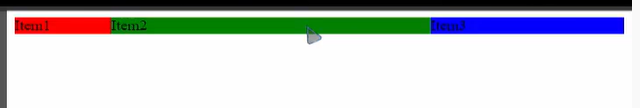
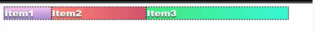
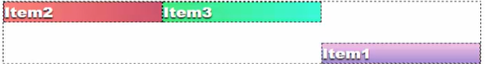
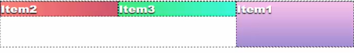
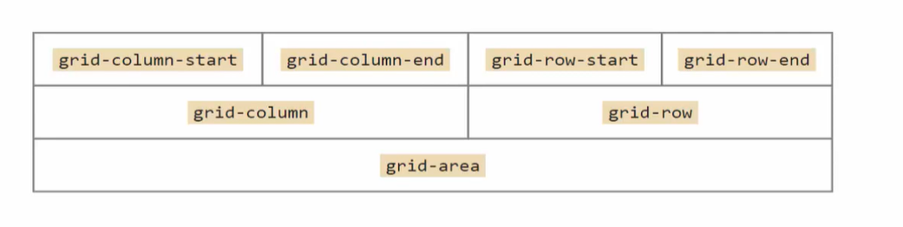

# Display grid

display:grid 
grid-template-columns: 100px, 1fr, 200px 

 

Fr - фактор гипции , коэфециент пропорциональности, отталкиеваться от общего колва фракций 

## Grid-template-columns 
grid-template-columns - центрирует наши элементы по горизантали делая их строчными, а в свойствах мы записываем размер элементов

Фракции работают как дроби 
Если у нас есть:

      grid-template-columns: 1fr 2 fr 3fr 

<b> Это эквивалентно 1\6, 2\6, 3\6 <b>

 

Парамаетры :
- px
- em
- %
- FR
- min-content
- max-content - подстаривается под ширину контента при этом создавая ползунок прокрутки, если контент слищком большой 
- minmax(min,max) - позволяет задавть гибкую ширину колонки через параметры 
- repeat(n, s ) n- кол-во элементов , s - их размер

## Grid-column-gap

      Grid-column-gap - свойства задет ширину между колонками 

# Управление размерами и позицией grid-элемент 

Свойства: 

    grid-column-start; 3 - начало по ширине 
    grid-column-end 4 - конец по ширине 
    grid-row-start; 3 - начало по высоте
    grid-row-end 4 - конец по высоте 

Можно сократить эти свойства и будет тоже самое 

       grid-column 3/4
        grid-row 3/4 

Можно сохратить еще больше 

      grid-area: 1/3/4/4 

(1/3 - это grid-column 1/3, 4/4 - это grid-row 4/4)

Для простоты запоминая 

 

      
